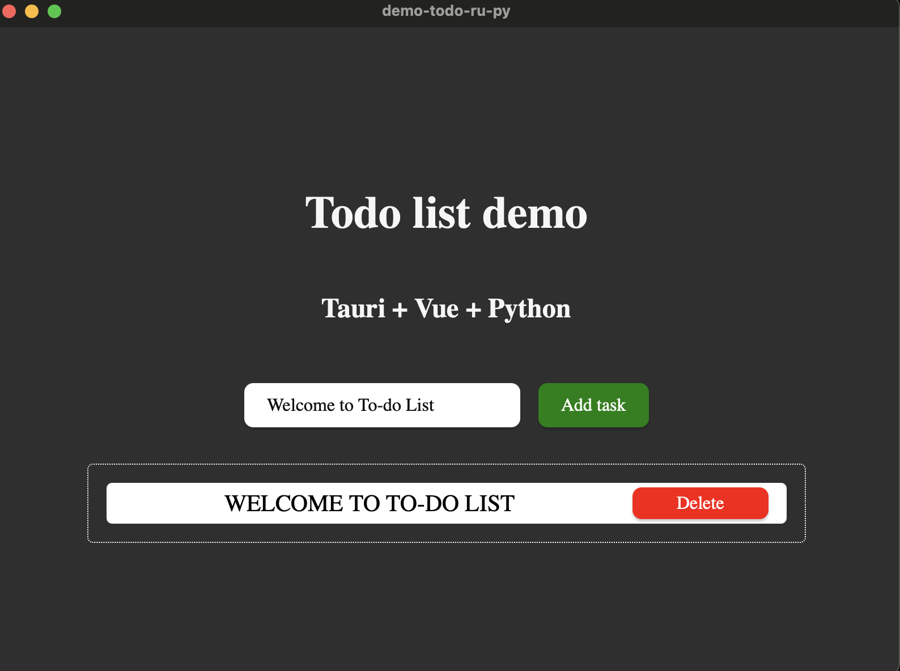

# Tauri Vue Python app demo tutorial 
This project is a To-do list app that aims to show a pattern demo for combining
Tauri + Vue + python

## Usage 

### Prerequisites : 
* [uv python package manager](https://docs.astral.sh/uv/guides/install-python/)
* [Cargo rust package manager](https://doc.rust-lang.org/cargo/getting-started/installation.html) 

### Usage in dev mode 

**Run backend** 
```
make run-dev-backend
```

**Run GUI** 
```
make run-dev-ui
```

### Build the desktop app 

```
# This will generate a bin ready for exec 
make build-app
```
This will generate a binary under : 
````
src-tauri/binaries/python_backend-[TRIPLE_TAURI_OS]
````
### How the app looks like 
